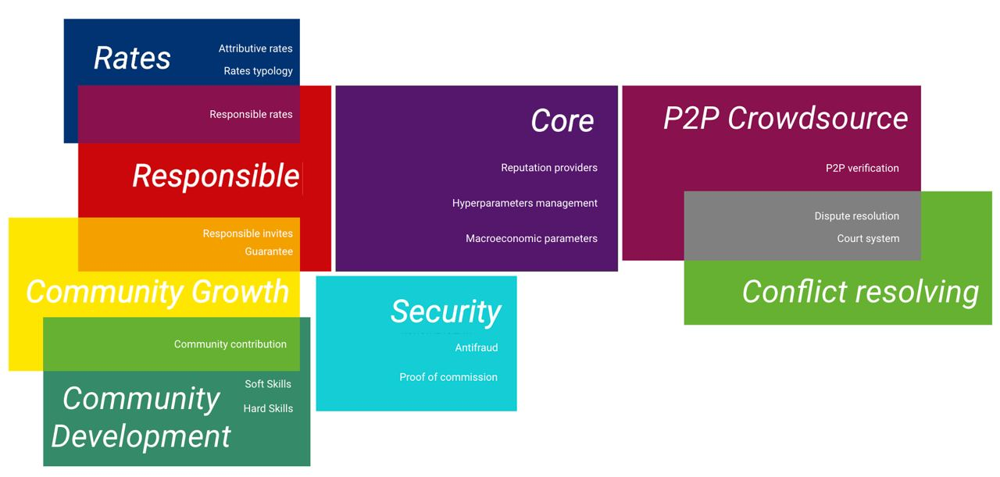

# WorkFi Tools

- **Team Name:** WorkFi.Tools Team
- **Payment Address:** 0xdCCE215A1170B53F2CAD85309a37bDD6b89c86EB (Ethereum USDC)
- **[Level](https://github.com/w3f/Grants-Program/tree/master#level_slider-levels):** 2

## Project Overview :page_facing_up: 

### Overview

WorkFi Tools are open source solutions to boost the WorkFi industry,
from decentralized freelance platforms to tools for complicated business processes.
This proposal focuses on one key subsystem of the WorkFi: the reputation system for counterparts.
It can also be suitable for a wide variety of other applications like decentralized Uber-like DAOs or marketplaces.
The implementation is supposed to be a set of smart-contracts for EVM-compatible blockchains like Moonbeam and others.

Our team is eager to create Open Source solutions (which are the subject of this proposal)
and build commercial projects on top of them (which defines our long-term interest in maintaining the project).

### Project Details

#### Guarantee

Guarantee the fact that the invited user fulfills his obligations. This part affects both: the inviter's rating
as well as the invited user's rating.

#### Responsible invites

Responsible attitude towards who a person invites to use the platform. The invitation can be withdrawn if the invited
users do not fulfill their obligations. This part affects the inviter's rating as well.

#### Responsible rates

Responsible attitude to how the user rates input of other members of the community, understanding the consequences
of his ratings for users and for his own rating level.

#### Attributive rates

Changes in reputation indicators depend on the user's competencies (software, hard skills, area of knowledge and work).

#### Rates typology

Relevant options for categorizing the most appropriate ways to rate users in certain cases.

#### Soft Skills (Community Development)

System of protocols for giving feedback to community users according to their soft skills in the most appropriate
and efficient way.

#### Hard Skills (Community Development)

System of protocols for giving feedback to community users according to their hard skills in the most appropriate and efficient way.

#### Community contribution

Community development system which includes ways to motivate and increase the level of user involvement
and contribution to the community.

#### Proof of commission

Algorithm for verifying user actions, including resistance to scam and fraudulent actions.

#### Anti fraud

Analysis and evaluation of use cases in which users can fraudulently raise their reputation and create bots;
solution development towards what changes should be implemented in the protocol to prevent such actions.

#### Reputation providers

Interaction of a service (platform) and several reputation providers, as well as ways to aggregate information
using data from several reputation providers.

#### Macroeconomic parameters
Macroeconomic regulation of reputation indicators and ways of changing reputation indicators depending on internal
economic trends within services.

#### Hypermarameters management

The relationship between changes in the rating of one user and the impact of these changes on the ratings
of other users - depending on the interaction between these particular users; as well as different options
for motivating and managing reputation indicators within services.

#### P2P verification

A system to determine which operations can be delegated for verification by the community itself
(KYC, diploma, level of knowledge, subjective assessment, and rating).

#### Dispute resolution

A system of involving qualified competent users in disputable cases to resolve conflict situations
(appeal, dispute, controversial cases).

#### Court system

A more complex and expensive conflict resolution system for serious situations - inspired by classical law.
The main focus is on the values of the community.

#### Tech stack

The tech stack that we are going to use is somewhat standard (with little choices to be made in the process):
Solidity for EVM smart-contracts, some parts of OpenZeppelin, Hardhat + Moralis for quicker development,
Frontier for compatibility with Polkadot parachains,
Node.js/TypeScript/TypeChain/Mocha/Chai/Jest for autotesting, Solhint/Prettier/Husky/ESLint for good code style,
presumably Laika, solidity-docgen and some other infrastructure tools.

### Ecosystem Fit

As there are multiple Substrate EVM-compatible blockchains thanks to Frontier layer,
with [some specific details](https://docs.moonbeam.network/learn/features/unified-accounts/) in mind,
Solidity smart-contracts implementation should fit the Substrate ecosystem nicely.
The smart-contracts should work correctly at least on Clover Finance, Astar, Parallel Finance, Moonbeam, and Acala.

Moreover, another goal is to research the possibility of cross-chain reputation system, starting from
(but not limited to) bridging across Polkadot parachains.
Also, after implementing contracts in Solidity (with which we have considerable experience), we will also research
the usage of other languages (like ink! for WASM smart-contracts) to make the functionality available as widely as possible.

The tools that we are building should provide dApp/DAO/solution developers with a solid abstraction layer
so that they can focus more on business logic and spend less time on designing and implementing
a reputation system themselves. As many industries need to digitize reputation/trust
(basically, all the services and products that can be provided of different quality, from dental treatment
to cars), we believe that our solutions will be of great utility for other creators.
Also, we are going to use them as well and build commercial services on top of them.

As the decentralized systems are expected to be trustless, the solutions have to be fraud-resistant
besides serving their main purpose.

There are some similar known projects:

- Your Justice, Web: https://www.yourjustice.life, https://yj.life
- Kleros, Web: https://kleros.io
- Orange, Web: https://www.orangeprotocol.io

Your Justice is a conflict resolving system. WorkFi Tools includes conflict resolving as a module as well, but it's a more extensive system focused on reputation.

Kleros' value proposition is decentralized arbitration for dispute resolution; our vision is more general as we consider dispute resolution a part of reputation system. A solution like Kleros might be used as a submodule of our system.

Orange doesn't provide means to create reputation (via voting or other means).
It only helps with aggregating on-chain data to interpret facts and behavior as reputation aspects.
While theoretically, this can be used for WorkFi, this makes each service that reads or modifies one's reputation to reinvent the wheel. We believe that ready-to-use reputation aspects and procedures for their modification will be much more helpful for the industry.

## Team :busts_in_silhouette:

### Team members

- Kir Guzenko (**team leader**, product owner, CTO, smart-contracts developer)
- Alexander Sirach (bizdev, IR)
- Artem Zolochevskii (fullstack, web3, and smart-contracts developer)
- Yakov (Iakov) Litvin (fullstack, web3, and smart-contracts developer, devops, software analyst)
- Dmitry Eremin (backend and smart-contracts developer, QA, software analyst)
- Lev Gavrilov (marketing, community)
- Vitaliy Ilnitskiy (UX design)

### Contact

- **Contact Name:** Kir Guzenko
- **Contact Email:** kee22r@gmail.com
- Additional contacts: Alexander Sirach (As@youscan.io), Lev Gavrilov (lev.gavrilov@gmail.com)
- **Website:** https://workfi.tools

### Legal Structure

No legal entity or structure yet.

- **Registered Address:** No Registered Address
- **Registered Legal Entity:** No Registered Legal Entity

### Team's experience

Projects and products that our dev team members have implemented or contributed to include:

- as K-22 outsource team:
  - Radiant Capital (https://app.radiant.capital, https://github.com/radiant-capital), including smart-contracts and frontend;
  - a (closed source) TypeScript SDK that unifies interaction with over 40 blockchains
    (operations like account creation, getting balance, sending coins, tokens, and much more);
  - customizations of Blockscout explorer (https://github.com/blockscout/blockscout)
    for a couple of blockchains deviating from standard EVM ones (critical backend bits + frontend);
- in the Chain.Cloud team (with Kir as co-founder):
  - Ethlend (an early version of Aave, https://github.com/aave, implemented on outsource);
  - more than 40 finished outsource projects for 2 years;
  - Thetta DAO Framework (https://github.com/Thetta, with Kir as co-founder);
- Anytype.io (https://github.com/anytypeio);
- an explorer for altcoins (bipcoin, dashcoin, karbowanec, etc), example: https://explorer.bip.mypool.online/;
- adaption of DeFi Geist sources to another crypto project;
- O0tie, a p2p matching service implementing some aspects of reputation system (didn't get into production due to a force majeure);
- maintaining Linux packages, translation/managing of translation of open source projects like XFCE,
  maintaining other open source software like TiddlyWiki Classic and related projects;
- various other non crypto-related projects, including non-commercial, startups, SMB and enterprises,
  doing web (fullstack), mobile, native apps development, devops etc.

Our team has a robust set of expertise including operations, product and marketing:

* Alexander has a proven track record building a tech company from 2 people to a market leader.
* Lev worked for over 10 years in the largest advertising agencies: BBDO, OMD, and ADV,
  wrote and implemented advertising strategies for brands such as Bayer and Renault,
  developed new methods and approaches to attract new customers as an account director.
* Vitaliy has more than 5 years of experience designing UI/UX for fintech, including VTB Bank,
  Alfa-Bank and several others, Grohe, Coca-Cola (products for employee training),
  robobattle.games and other crypto projects.

#### Team motivation and commitment

We are a team of crypto enthusiasts, and our interest in this project is driven by both
desire to create something big and valuable (WorkFi and tools for it)
and a goal to build a great commercial product on top of that.
These define our long-term commitment to the project.
This first stage consists of creating libs and infrastructure for WorkFi,
building community so that we have more feedback and more entrepreneurs start their projects,
thus boosting the future WorkFi industry.

Our interests are somewhat diverse throughout the team:

- Kir, who participated in and initialed various DAO and crypto projects since 2016,
  is mainly interested in creating a great product and industry;
- Alexander, being a serial tech entrepreneur in SaaS, has been researching DAOs since 2017
  and is now ready to contribute as he believes we can reimagine the way we work;
- For Lev, experienced in marketing and community building (over 10 years in the largest advertising agencies), this is his first participation in a DAO,
  and he sees the principal value of this project in building a society that effectively shares knowledge in a p2p manner;
- Vitaliy has been designing UI/UX for fintech for over 5 years
  and considers the crypto industry as an exciting area of challenges, more dynamic, and full of breakthrough projects;
- Yakov has experience in crypto projects since the beginning of 2021 and dev experience since 2010 (including
  open source dev/maintaining), and is interested in DAO both from the product and game theory angles
- Dmitry, while having experience in dev for crypto (and overall 7 years in fintech as QA, dev and DevOps), participates in a DAO for the first time.
  He is sure that the future belongs to distributed systems and wants to take part in shaping of one of these;
- Artem has over 20 years of experience in dev/devops, maintaining Linux packages, managing open source development
  and 2 years in crypto. He sees this project as a great opportunity to contribute into blockchain ecosystem.

### Team Code Repos

- https://github.com/Thetta
- https://github.com/workfi-tools

All dev team members have 7-20 years of experience. Github accounts:

- Kir: https://github.com/enkogu
- Yakov: https://github.com/YakovL
- Dmitry: https://github.com/EreminD
- Artem: https://github.com/azol

### Team LinkedIn Profiles

- Alexander: https://www.linkedin.com/in/asirach
- Dmitry: https://www.linkedin.com/in/ereminD
- Lev: https://www.linkedin.com/in/lev-gavrilov-354ab4121/
- Vitaliy: https://www.linkedin.com/in/vitaliy-ilnitskiy-35536538/

## Development Status :open_book:

The initical code contains draft documentation as well as the draft interfaces for the further development.

- https://github.com/workfi-tools

## Development Roadmap :nut_and_bolt:

This section should break the development roadmap down into milestones and deliverables. To assist you in defining it, we have created a document with examples for some grant categories [here](../docs/grant_guidelines_per_category.md). Since these will be part of the agreement, it helps to describe _the functionality we should expect in as much detail as possible_, plus how we can verify and test that functionality. Whenever milestones are delivered, we refer to this document to ensure that everything has been delivered as expected.

Below we provide an **example roadmap**. In the descriptions, it should be clear how your project is related to Substrate, Kusama or Polkadot. We _recommend_ that teams structure their roadmap as 1 milestone ≈ 1 month.

For each milestone,

- make sure to include a specification of your software. _Treat it as a contract_; the level of detail must be enough to later verify that the software meets the specification.
- include the amount of funding requested _per milestone_.
- include documentation (tutorials, API specifications, architecture diagrams, whatever is appropriate) in each milestone. This ensures that the code can be widely used by the community.
- provide a test suite, comprising unit and integration tests, along with a guide on how to set up and run them.
- commit to providing Dockerfiles for the delivery of your project.
- indicate milestone duration as well as number of full-time employees working on each milestone.
- **Deliverables 0a-0d are mandatory for all milestones**, and deliverable 0e at least for the last one. If you do not intend to deliver one of these, please state a reason in its specification (e.g. Milestone X is research oriented and as such there is no code to test).

> :zap: If any of your deliverables is based on somebody else's work, make sure you work and publish _under the terms of the license_ of the respective project and that you **highlight this fact in your milestone documentation** and in the source code if applicable! **Teams that submit others' work without attributing it will be immediately terminated.**

### Overview

- **Total Estimated Duration:** Duration of the whole project (e.g. 2 months)
- **Full-Time Equivalent (FTE):**  Average number of full-time employees working on the project throughout its duration (see [Wikipedia](https://en.wikipedia.org/wiki/Full-time_equivalent), e.g. 2 FTE)
- **Total Costs:** Requested amount in USD for the whole project (e.g. 12,000 USD). Note that the acceptance criteria and additional benefits vary depending on the [level](../README.md#level_slider-levels) of funding requested. This and the costs for each milestone need to be provided in USD; if the grant is paid out in Bitcoin, the amount will be calculated according to the exchange rate at the time of payment.

### Milestone 1 Example — Implement Substrate Modules

- **Estimated duration:** 1 month
- **FTE:**  2
- **Costs:** 8,000 USD

| Number | Deliverable | Specification |
| -----: | ----------- | ------------- |
| 0a. | License | Apache 2.0 / GPLv3 / MIT / Unlicense |
| 0b. | Documentation | We will provide both **inline documentation** of the code and a basic **tutorial** that explains how a user can (for example) spin up one of our Substrate nodes and send test transactions, which will show how the new functionality works. |
| 0c. | Testing Guide | Core functions will be fully covered by unit tests to ensure functionality and robustness. In the guide, we will describe how to run these tests. |
| 0d. | Docker | We will provide a Dockerfile(s) that can be used to test all the functionality delivered with this milestone. |
| 0e. | Article | We will publish an **article**/workshop that explains [...] (what was done/achieved as part of the grant). (Content, language and medium should reflect your target audience described above.)
| 1. | Substrate module: X | We will create a Substrate module that will... (Please list the functionality that will be implemented for the first milestone) |  
| 2. | Substrate module: Y | We will create a Substrate module that will... |  
| 3. | Substrate module: Z | We will create a Substrate module that will... |  
| 4. | Substrate chain | Modules X, Y & Z of our custom chain will interact in such a way... (Please describe the deliverable here as detailed as possible) |  

### Milestone 2 Example — Additional features

- **Estimated Duration:** 1 month
- **FTE:**  1
- **Costs:** 4,000 USD

...

### Milestone 1 — Reputation system

- **Estimated duration:** ? month
- **FTE:**  ?
- **Costs:** ?,000 USD

Protocol and MVP.

### Milestone 2 — Court system and P2P

- **Estimated duration:** ? month
- **FTE:**  ?
- **Costs:** ?,000 USD

Protocol and MVP.

### Milestone 3 — Certification

- **Estimated duration:** ? month
- **FTE:**  ?
- **Costs:** ?,000 USD

Protocol and MVP.

### Milestone 4 — SDK

- **Estimated duration:** ? month
- **FTE:**  ?
- **Costs:** ?,000 USD

- Advanced votings
- Booking
- SDK
- Integrations

### Milestone 5 — Web3 token access

- **Estimated duration:** ? month
- **FTE:**  ?
- **Costs:** ?,000 USD

Protocol and MVP.

## Future Plans

Our future plans include both promoting the reputation system and creating more components for WookFi,
like Web3 Auth Token, Web3 Certification system, Web3 Booking system and/or others.

## Additional Information :heavy_plus_sign:

**How did you hear about the Grants Program?**
The source of the information is the Web3 Foundation Website.
